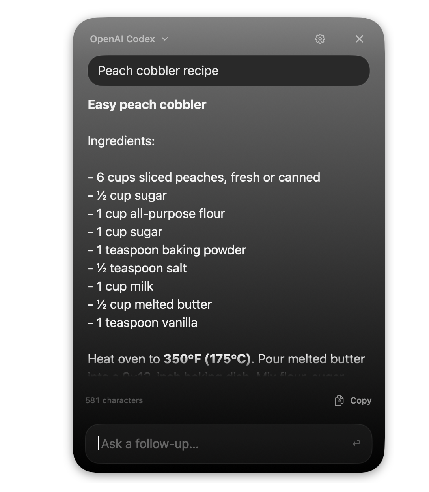

# Kvartz

Kvartz is a small native macOS menu-bar utility for short LLM queries. Press a global shortcut, type a question, and read a compact Markdown response in a floating black-glass panel.



## Included providers

- OpenAI (Responses API)
- Anthropic
- Google Gemini
- Qwen
- Kimi
- GLM
- OpenRouter
- Ollama
- OpenAI Codex via the local `codex app-server` and ChatGPT sign-in

API keys are stored in macOS Keychain. Provider models, base URLs, and the activation shortcut are configurable.

## Install

Kvartz requires macOS 14 or later and an Apple Silicon Mac.

1. Download [`Kvartz-0.1.0-macOS-arm64.zip`](Builds/Kvartz-0.1.0-macOS-arm64.zip).
2. Unzip it and move `Kvartz.app` to your Applications folder.
3. Open `Kvartz.app` once. Because this build is not notarized, macOS may block the first launch.
4. Open **System Settings → Privacy & Security**, scroll to **Security**, then click **Open Anyway** beside Kvartz.
5. Confirm by clicking **Open**. macOS saves Kvartz as an exception, so future launches work normally.

Only override Gatekeeper for a copy downloaded from this repository. Do not disable Gatekeeper globally. See [Apple's guidance for opening an app from an unidentified developer](https://support.apple.com/102445).

## Build from source

Requires Xcode 16 or later.

```sh
./scripts/build-app.sh
open dist/Kvartz.app
```

The script creates an ad-hoc signed app at `dist/Kvartz.app`. For distribution, replace the ad-hoc signature with your Developer ID and notarize the bundle.

Modifier-only shortcuts rely on macOS Input Monitoring. During development, sign local builds with a stable Apple Development identity so that permission survives rebuilds:

```sh
CODE_SIGN_IDENTITY="Apple Development: Your Name (TEAMID)" ./scripts/build-app.sh
```

To create a ZIP for Apple Silicon Macs:

```sh
./scripts/build-public.sh
```

By default, the public build is ad-hoc signed. Set `CODE_SIGN_IDENTITY` to a Developer ID Application certificate name to produce a hardened, timestamped distribution signature. Apple notarization still requires configured notary credentials.

## Interaction

- Default shortcut: `⌥Space`
- The shortcut recorder captures double-taps of Command/Option/Control/Shift and left+right modifier chords
- Modifier-only triggers require Input Monitoring permission in macOS Privacy & Security settings and an app relaunch after approval
- Return: submit
- Shift–Return: insert a new line
- Escape: hide Kvartz when the input field is empty
- The editor and panel grow with their content
- The panel opens beside the cursor on the current display and stays inside the visible screen
- Settings can switch panel opening between `Near Cursor` and its saved `Last Position`
- Ask follow-up questions without losing the conversation context
- Edit the response prompt under Settings → General
- The panel stays open until you click ×
